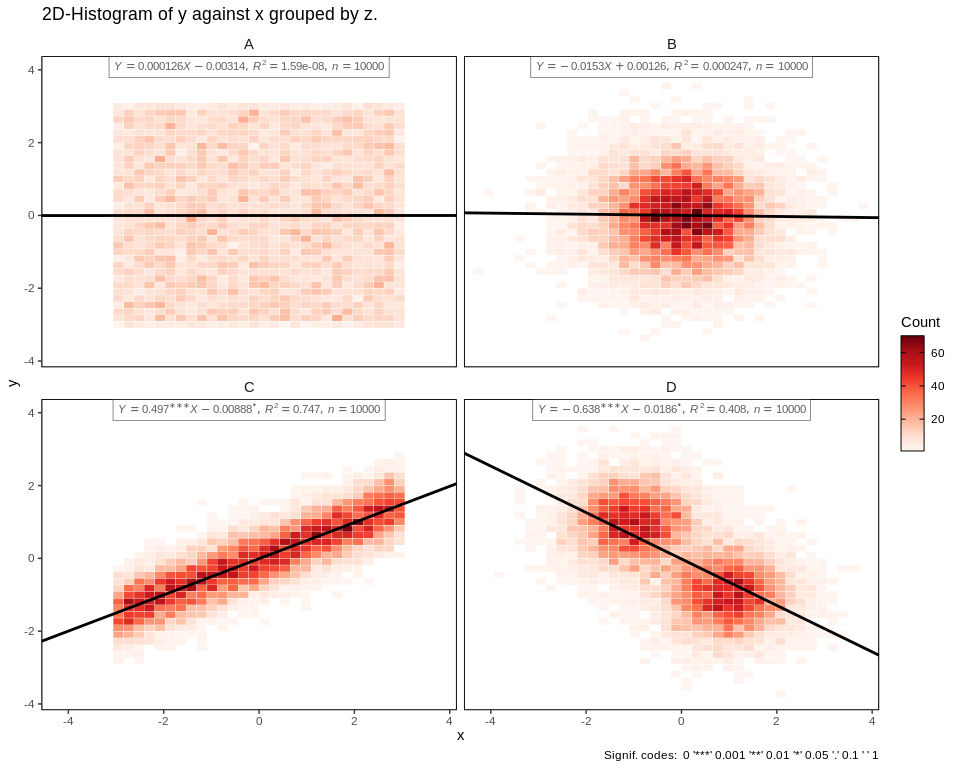

<!-- README.md is generated from README.Rmd. Please edit that file -->

# artidata.viz

<!-- badges: start -->

<!-- badges: end -->

Artidata’s Personal Data Visualization
Package

## Installation

<!-- You can install the released version of artidata.viz from [CRAN](https://CRAN.R-project.org) with: -->

<!-- ``` r -->

<!-- install.packages("artidata.viz") -->

<!-- ``` -->

Install the development version from [GitHub](https://github.com/) with:

``` r
# install.packages("devtools")
devtools::install_github("artidata/artidata.viz")
```

## Example

Setting up a random dataset:

``` r
library(artidata.viz)
library(data.table)
library(ggplot2)
library(scales)

set.seed(240193)

N=10000

dtA=data.table(x=runif(N,-3,3),y=runif(N,-3,3),z="A")

dtB=data.table(x=rnorm(N),y=rnorm(N),z="B")

dtC=data.table(x=seq(-3,3,length.out = N))
dtC[,":="(y=0.5*x+rnorm(N,sd=0.5),z="C"),]

dtD=data.table(x=c(rnorm(N/2,-1,.75),rnorm(N/2,1,.75)),
               y=c(rnorm(N/2,1,.75),rnorm(N/2,-1,.75)),
               z="D")

dt1=rbindlist(list(dtA,dtB,dtC,dtD))
```

The default scatter plot:

``` r
ggplot(dt1,aes(x,y))+
  geom_point(size=0.1)+
  facet_wrap(vars(z))
```


The default ggplot2 2D-histogram:

``` r
ggplot(dt1,aes(x,y))+
  geom_bin2d()+
  facet_wrap(vars(z))
```


2D-Histogram output:

``` r
hist2d(dt1,facet=1)
```


You can also add regression line and choose a theme:

``` r
hist2d(dt1,facet=1,hasLine=T)
#>    z           b0         se0         p0            b1         se1        p1
#> 1: A -0.003136379 0.017407808 0.85702210  0.0001257856 0.009965383 0.9899294
#> 2: B  0.001260919 0.009794744 0.89757052 -0.0153182155 0.009739820 0.1158104
#> 3: C -0.008884770 0.005015223 0.07649805  0.4973084183 0.002895251 0.0000000
#> 4: D -0.018616805 0.009570524 0.05177611 -0.6381162003 0.007681034 0.0000000
#>             rsq     n            sym0
#> 1: 1.593532e-08 10000                
#> 2: 2.473398e-04 10000                
#> 3: 7.468981e-01 10000 symbol('\\267')
#> 4: 4.083941e-01 10000 symbol('\\267')
#>                                               sym1
#> 1:                                                
#> 2:                                                
#> 3: symbol('\\052')*symbol('\\052')*symbol('\\052')
#> 4: symbol('\\052')*symbol('\\052')*symbol('\\052')
#>                                                                                                                                                       label
#> 1:                                                              list(italic(Y)==1.26e-04^{ }*italic(X)-3.14e-03^{ },italic(R^2)==1.59e-08,italic(n)==10000)
#> 2:                                                             list(italic(Y)==-1.53e-02^{ }*italic(X)+1.26e-03^{ },italic(R^2)==2.47e-04,italic(n)==10000)
#> 3:  list(italic(Y)==4.97e-01^{symbol('\\052')*symbol('\\052')*symbol('\\052')}*italic(X)-8.88e-03^{symbol('\\267')},italic(R^2)==7.47e-01,italic(n)==10000)
#> 4: list(italic(Y)==-6.38e-01^{symbol('\\052')*symbol('\\052')*symbol('\\052')}*italic(X)-1.86e-02^{symbol('\\267')},italic(R^2)==4.08e-01,italic(n)==10000)
```


